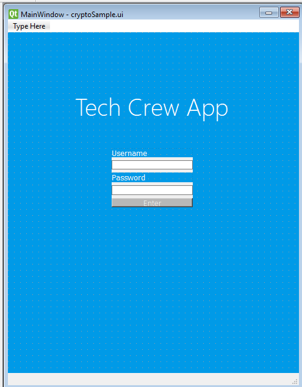
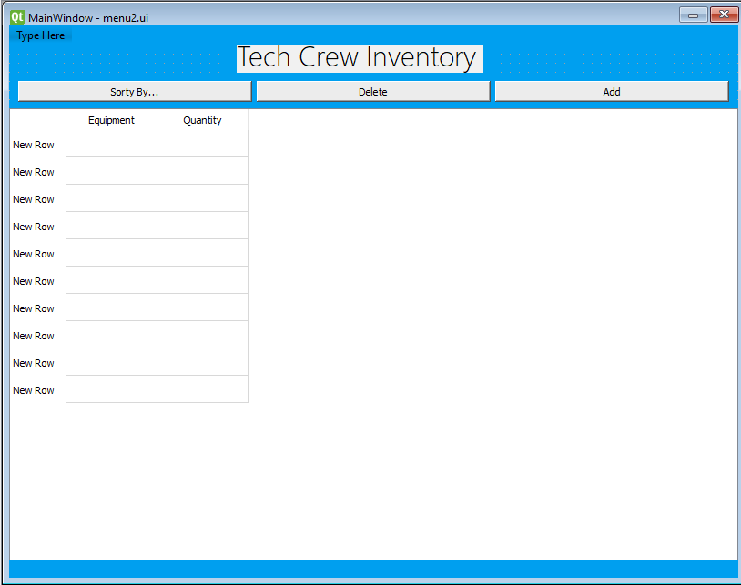
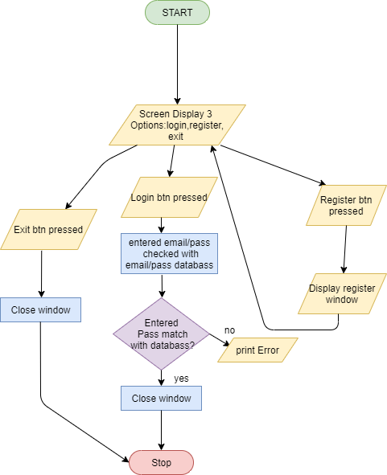
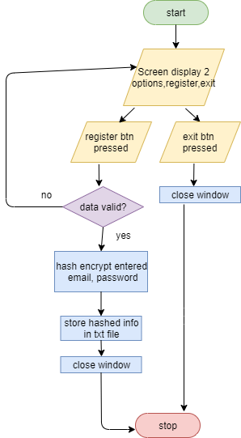
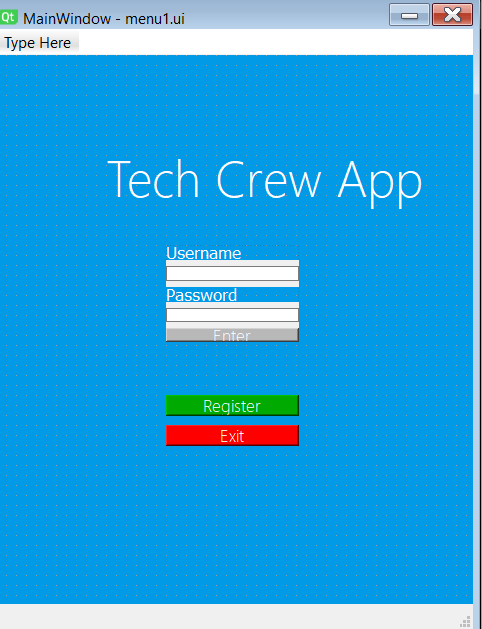
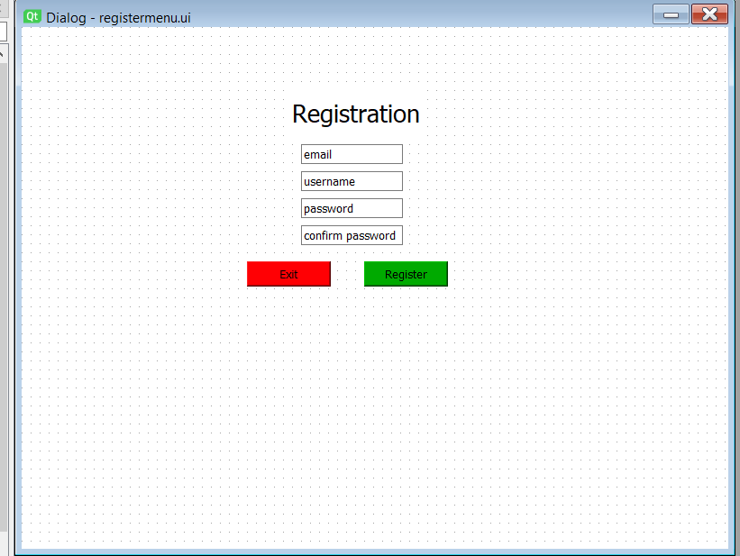

# Criteria B- Design
---------------
User login feature steps

Registration
1.)Input username
2.)Input password
3.)confirm password
4.)generate salt
5.)use the hash lib function
6.) store info user_dict

## Prototype 1 for user interface on Qtdesigner
-Main Menu/login

-List view of equipment

-Equipment information page

**USER FEEDBACK and Revision**

-Add "Functioning?" descriptor in table view of equipments, as well in equipment information view

-Create new "events" window, where upcoming events and previous events can be listed, store information of equipment too.

-Retitle all widgets to seperate and clearly identify during coding

In your role of a developer: read the client statement and write a draft version for the Criteria for Success in order of priority: most to least important.  Measurable, Specific, Non-trivial

## Prototype 2 for user interface on Qtdesigner

-A new registration window has been created, and registration button has been added to the login screen.

-In the main menu, "functionality" has been added to the table view as a column

-The login menu has been changed from a mainmenuui to a Qdialog, 

-Main menu has been changed to mainmenuui 
## login menu basic concept flowchart

## registration menu basic concept flowchart

-All widgets have been named to mark their functionality and which page they are on to make coding easier.

