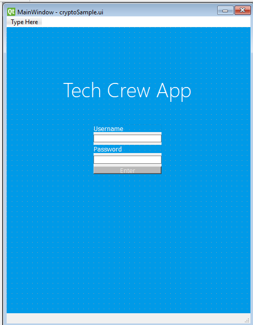

# Criteria A- Planning

## Definition of the problem
The client is Nabill Nuqman, who is requesting an app for the Tech Crew Club.
As a member of tech crew, Nabill often suffers due to the lack of organization in keeping track of equipment. Due to the lack of a proper recording system on equipment, tech trew struggles to find equipment and information on equipment when they need it. The client would like a way to keep track of everything tech crew is in possension of, as well as being able to track specific information about the equipments.
## Proposed Solution
- Develop an app for the client which will act as a database, and will store all the tech crew equipment information, allowing users to edit information, as well as access it with ease.
-The app will fill all requirements for client, and make checking inventory of tech crew easy, as well as being able to record and store information
-Python will be used for the app, as it is a versatile language and is compatible with an interface designer app- qt designer, and will allow for importing functions into the app.
## Success Criteria:
1.)Exclusively for tech crew members- login/password. The user can register an email, username, password which is then stored securely and can be used to log in.

2.) The app can store info on which items tech crew has/does not have

3.) Quantity information can be easily accessed and edited by user

3.) The app allows for a user to record when equipment have been used in the past,

4.) Equipment information is also neatly stored and easily accessed

4.) Condition of each item is also stored and able to be edited in app- is it broken? operational? dirty?

5.) App should be easy to use, and only requires simple instructions

Developer plan- client will be involved in the entire process of development, giving feedback, wants complaints etc. 

# Criteria B- Development
---------------
User login feature steps

Registration
1.)Input username
2.)Input password
3.)confirm password
4.)generate salt
5.)use the hash lib function
6.) store info user_dict

Prototype 1 for user interface on Qtdesigner
-Main Menu/login

-List view of equipment

-Equipment information page

**USER FEEDBACK and Revision**

-Add "Functioning?" descriptor in table view of equipments, as well in equipment information view

-Create new "events" window, where upcoming events and previous events can be listed, store information of equipment too.

-Retitle all widgets to seperate and clearly identify during coding

In your role of a developer: read the client statement and write a draft version for the Criteria for Success in order of priority: most to least important.  Measurable, Specific, Non-trivial

